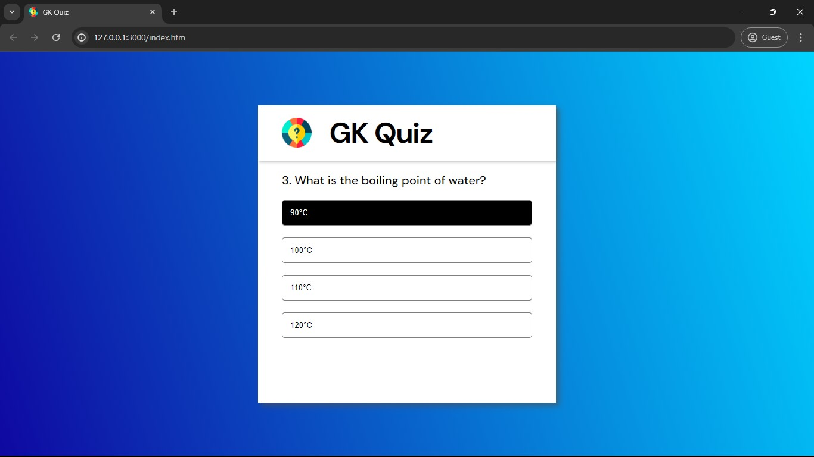
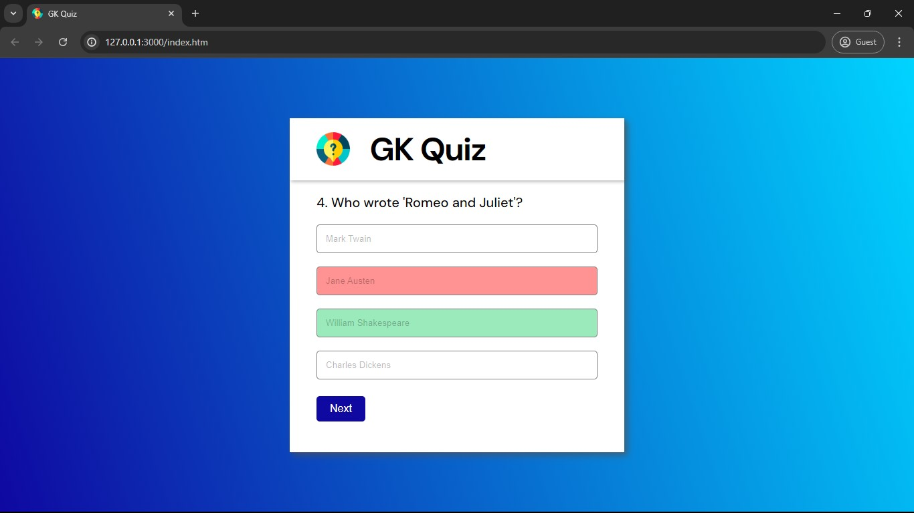
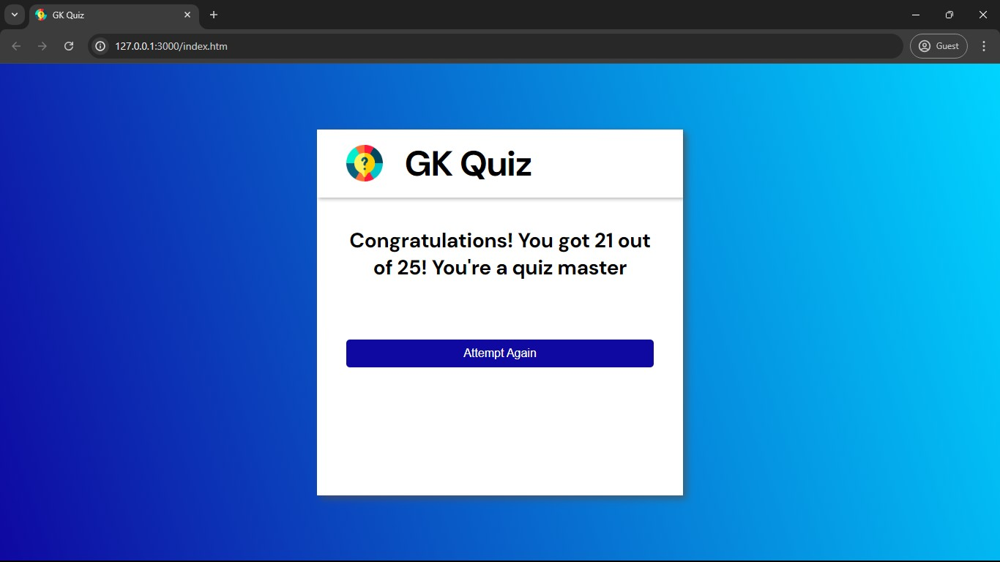

# GK Quiz App

Welcome to the GK Quiz project! This is a simple web-based quiz application designed to test and improve your general knowledge.

## Table of Contents

- [Demo](#demo)
- [Features](#features)
- [Installation](#installation)
- [Usage](#usage)
## Demo









## Features

- Begin the quiz with a simple button click.
- Answer a variety of questions.
- Get instant feedback on your performance.
- Retake the quiz as many times as you want.
- Works on both desktop and mobile devices.


## Installation

To get a local copy up and running follow these simple steps:

1. Clone the repository:
   ```sh
   https://github.com/aimless-coder/GK_Quiz_App.git
   ```

2. Open `index.html` in your browser

    
## Usage

- Click the "Start Now" button to begin the quiz.
- Select your answer from the available options.
- Click "Next" to proceed to the next question.
- At the end of the quiz, your score will be displayed.
- Click "Attempt Again" to restart the quiz.


